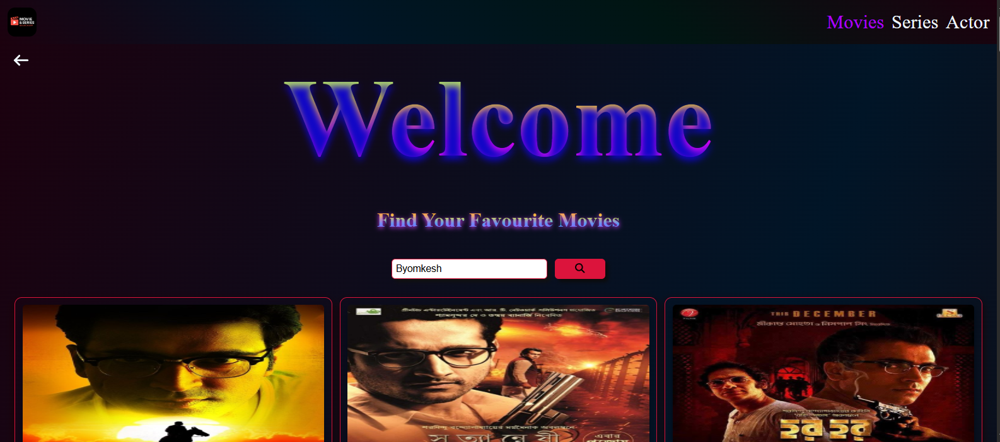
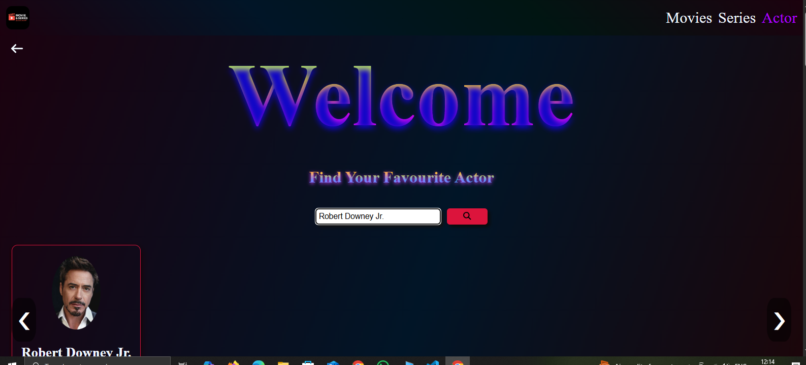
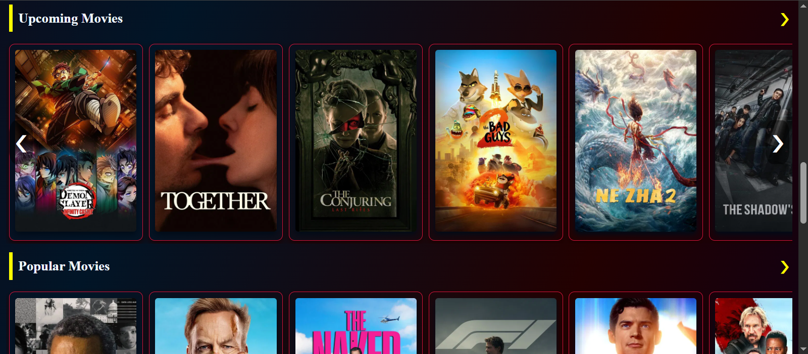
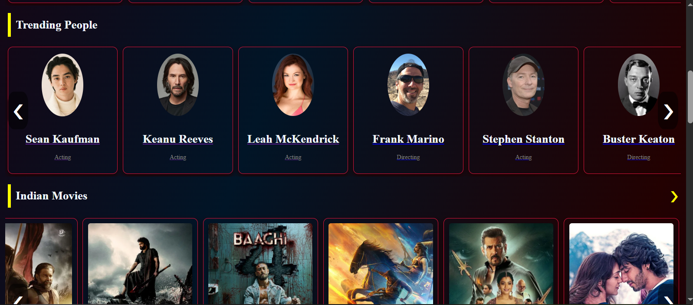

# react-movie-explorer

🎬 A React-based movie search application powered by the TMDB API. Users can search for movies, TV series, and actors, view trending and popular content, and explore detailed information with a clean and responsive UI. Built with React, Vite, Context API, and CSS Modules for state management and styling.

## 🚀 Features

- 🔎 Search for movies, series, and actors
  
  

  
  
  

- 🎥 Browse trending, popular, top-rated, and upcoming movies
  
- 👤 Explore popular and trending actors
  
  
- 📄 Detailed movie & actor information
  
  

  
  

- 📱 Responsive design with CSS Modules
  
  
- ⚡ Fast performance with Vite + Context API

## 🛠️ Tech Stack

- React
- Vite
- Context API
- CSS Modules
- TMDB API

  ## Installation

1. Clone the repo

```bash
  git clone https://github.com/SudhangsuShekharBairagi/react-movie-explorer.git
  cd react-movie-explorer
```

2. Install Dependencies

```bash
 npm install
```

3. Add Your API Key

- |- scr/
- |- dataFetch/tmdb.js

4. Start the Development Server

```bash
   npm run dev
```

- If you want to see in moblie run

```bash
npx vite --host
```
